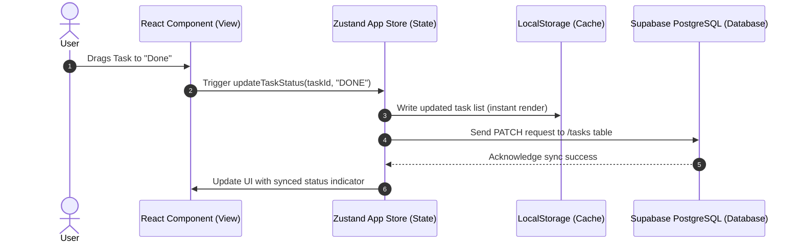

# 🛡️ ProjTrack — Next-Gen Project Portfolio & Task Intelligence

ProjTrack is an enterprise-grade, high-performance project and portfolio management platform designed for modern, agile teams. It combines visual workflows, spreadsheet-like efficiency, automated reporting, and comprehensive compliance audit logs into a single, unified workspace.

---

## 📖 Table of Contents
1. [🌟 Product Overview & Core Philosophy](#-product-overview--core-philosophy)
2. [🚀 Key Features](#-key-features)
3. [🛠️ Detailed Tech Stack & Usecases](#️-detailed-tech-stack--usecases)
4. [📈 System Architecture](#-system-architecture)
5. [🗄️ Database Schema & Data Models](#️-database-schema--data-models)
6. [📂 Project Structure](#-project-structure)
7. [⚙️ Getting Started & Installation](#️-getting-started--installation)
8. [🔒 Security & Audit Compliance](#-security-&amp;-audit-compliance)

---

## 🌟 Product Overview & Core Philosophy

In modern software and project management environments, teams are often forced to context-switch between three distinct types of tools:
1. **Agile Task Trackers** (e.g., Jira, Trello) which focus on workflow stages.
2. **Tabular Spreadsheets** (e.g., Excel, Smartsheet) which excel at bulk editing and dense information layouts.
3. **Executive Dashboards** (e.g., PowerBI, manual slide decks) which aggregate health and reporting.

**ProjTrack** bridges these gaps by offering a **unified state engine** that instantly synchronizes updates across all three perspectives. Changing a task's status on the Kanban Board instantly updates the Spreadsheet Grid, updates the Gantt timeline, recalculates the project health indicator on the Dashboard, and writes an immutable entry to the Security Audit Log.

---

## 🚀 Key Features

### 1. 📊 Portfolio Management
*   **Aggregation:** Group related projects into portfolios (e.g., "Q3 Product Launch", "Internal IT Infrastructure").
*   **KPI Tracking:** View aggregate health status (`ON_TRACK`, `AT_RISK`, `CRITICAL`), cumulative budgets, and upcoming deadlines at a glance.
*   **Custom Status Configs:** Define custom workflow stages mapped to standard lifecycle categories (`todo`, `in_progress`, `review`, `done`).

### 2. 📋 Interactive Kanban Boards
*   **Drag-and-Drop:** Built on `@dnd-kit/core` and `@hello-pangea/dnd` for fluid, hardware-accelerated card transitions.
*   **Inline Editing:** Instantly rename tasks, change assignees, or adjust priorities from the card interface.
*   **Status Constraints:** Configured workflow columns enforce logical status movements.

### 3. ⚡ High-Performance Spreadsheet Grid
*   **Dense View:** Designed for power-users who need to manage hundreds of tasks.
*   **Keyboard Navigation:** Supports rapid traversal, inline editing of cells, and bulk updates.
*   **Dynamic Filtering:** Filter by assignee, priority, status, or due date instantly with client-side reactive filtering.

### 4. 📈 Intelligent Dashboard & Reporting
*   **Recharts Visualizations:** Interactive charts showing velocity, burndown rate, and workload distribution.
*   **Automatic Health Engine:** A heuristic algorithm (`src/lib/health-engine.ts`) automatically calculates project health based on overdue tasks, blocker counts, and milestone delays.

### 5. ⏱️ Real-Time Activity Feed & Audit Logs
*   **User Activity Stream:** Shows a live timeline of team contributions.
*   **Enterprise-Grade Audit Trail:** Records `old_value` vs `new_value` for every state transition, ensuring full traceability for compliance.

---

## 🛠️ Detailed Tech Stack & Usecases

### Core Framework
*   **Next.js 16 (App Router)**
    *   *Definition:* A React framework providing hybrid static & server rendering, route pre-fetching, and server actions.
    *   *Usecase:* Houses the routing architecture. Page folders (`src/app/*`) map to distinct application modules. Next.js Server Components optimize initial page load speeds, while Client Components handle highly interactive elements like the Kanban board.
*   **React 19**
    *   *Definition:* The latest major version of the component-driven frontend library.
    *   *Usecase:* Powers the reactive, virtual-DOM-driven UI, enabling instantaneous state rendering.

### State Management
*   **Zustand 5**
    *   *Definition:* A lightweight, hook-based state management library with minimal boilerplate.
    *   *Usecase:* Serves as the global application store (`src/store/app-store.ts`). It caches project data in `localStorage` for instant rendering (Zero-CLS/Cumulative Layout Shift) and asynchronously reconciles local state with the backend database.

### Backend & Database
*   **Supabase (PostgreSQL)**
    *   *Definition:* A relational database-as-a-service providing real-time synchronization and Row-Level Security (RLS).
    *   *Usecase:* Acts as the source of truth. ProjTrack communicates with Supabase via `@supabase/supabase-js` to perform CRUD operations on projects, tasks, and audit logs.

### UI & Styling
*   **Tailwind CSS v4**
    *   *Definition:* A utility-first CSS framework with an updated, high-performance compiler.
    *   *Usecase:* Implements the visual styling including deep navy background layers, gold accents, glassmorphism, and responsive layouts.
*   **Shadcn UI & Radix Primitives**
    *   *Definition:* Accessible, unstyled UI components that can be styled with Tailwind.
    *   *Usecase:* Forms the foundation of interactive controls (dialogs, tooltips, select boxes, dropdown menus).

---

## 📈 System Architecture

The diagram below outlines the flow of data when a user interacts with ProjTrack:



---

## 🗄️ Database Schema & Data Models

Below are the primary TypeScript interfaces (`src/lib/types.ts`) mapping to the database tables:

### 1. `Project`
Represents a project space containing tasks and milestones.
```typescript
export type Project = {
  id: string;
  portfolio_id: string | null;
  organization_id: string;
  name: string;
  description: string | null;
  project_type: "SOFTWARE" | "CONSTRUCTION" | "EVENT" | "MARKETING" | "RESEARCH" | "GENERAL";
  budget: number | null;
  deadline: string | null;
  health_status: "ON_TRACK" | "AT_RISK" | "CRITICAL";
  is_completed: boolean;
  status_config: StatusConfig[];
  created_at: string;
  updated_at: string;
}
```

### 2. `Task`
An actionable work item associated with a project.
```typescript
export type Task = {
  id: string;
  milestone_id: string | null;
  project_id: string;
  title: string;
  description: string | null;
  status: string;
  priority: "LOW" | "MEDIUM" | "HIGH" | "CRITICAL";
  assignee_id: string | null;
  due_date: string | null;
  estimated_hours: number | null;
  actual_hours: number | null;
  blocked_reason: string | null;
  is_critical_path: boolean;
  sort_order: number;
  created_at: string;
  updated_at: string;
}
```

### 3. `AuditLog`
An immutable log of all changes for compliance tracking.
```typescript
export type AuditLog = {
  id: string;
  project_id: string;
  actor_id: string;
  action: string; // e.g., "UPDATE_TASK_STATUS"
  field_changed: string | null; // e.g., "status"
  old_value: string | null; // e.g., "IN_PROGRESS"
  new_value: string | null; // e.g., "DONE"
  created_at: string;
}
```

---

## 📂 Project Structure

```text
projtrack/
├── public/                 # Static assets (logos, icons, illustrations)
├── src/
│   ├── app/                # Next.js App Router Pages
│   │   ├── activity/       # User Activity Feed
│   │   ├── audit/          # Compliance Audit Logs page
│   │   ├── auth/           # Login/Signup/Reset routes
│   │   ├── dashboard/      # Executive Recharts Dashboard
│   │   ├── projects/       # Kanban, Gantt, and Spreadsheet views
│   │   ├── portfolios/     # Portfolios view
│   │   ├── reports/        # Project status reports page
│   │   ├── settings/       # Settings and user configuration
│   │   ├── layout.tsx      # App wrapper (providers, sidebar, topbar)
│   │   └── page.tsx        # Landing Page
│   ├── components/         # Component Library
│   │   ├── kanban/         # Kanban board & card items
│   │   ├── spreadsheet/    # Grid view data rows
│   │   ├── layout/         # Navigation components (Sidebar, TopNav)
│   │   └── ui/             # Shadcn UI primitives
│   ├── lib/                # Shared Utilities & Business Logic
│   │   ├── health-engine.ts# Auto-health calculator
│   │   ├── types.ts        # TypeScript models
│   │   └── supabase/       # Supabase client configurations
│   └── store/              # Zustand global store (app-store.ts)
├── package.json            # Scripts & dependencies
└── tsconfig.json           # TS configurations
```

---

## ⚙️ Getting Started & Installation

### Prerequisites
*   **Node.js** (v18.x or higher)
*   **Supabase Account** with an active PostgreSQL database

### 1. Clone & Install Dependencies
```bash
git clone <repository-url>
cd projtrack
npm install
```

### 2. Set Up Database Schema
Run the following DDL script in your Supabase SQL Editor to create the necessary tables:
```sql
-- Projects Table
CREATE TABLE projects (
  id UUID PRIMARY KEY DEFAULT gen_random_uuid(),
  workspace_id TEXT NOT NULL,
  name TEXT NOT NULL,
  status TEXT DEFAULT 'SOFTWARE',
  color TEXT DEFAULT 'ON_TRACK',
  created_at TIMESTAMP WITH TIME ZONE DEFAULT timezone('utc'::text, now()) NOT NULL,
  updated_at TIMESTAMP WITH TIME ZONE DEFAULT timezone('utc'::text, now()) NOT NULL
);

-- Tasks Table
CREATE TABLE tasks (
  id UUID PRIMARY KEY DEFAULT gen_random_uuid(),
  project_id UUID REFERENCES projects(id) ON DELETE CASCADE,
  title TEXT NOT NULL,
  description TEXT,
  status TEXT NOT NULL,
  priority TEXT DEFAULT 'MEDIUM',
  assignee_id TEXT,
  due_date DATE,
  estimate_minutes INTEGER,
  created_at TIMESTAMP WITH TIME ZONE DEFAULT timezone('utc'::text, now()) NOT NULL,
  updated_at TIMESTAMP WITH TIME ZONE DEFAULT timezone('utc'::text, now()) NOT NULL
);

-- Audit Logs Table
CREATE TABLE audit_logs (
  id UUID PRIMARY KEY DEFAULT gen_random_uuid(),
  project_id UUID REFERENCES projects(id) ON DELETE CASCADE,
  actor_id TEXT NOT NULL,
  action TEXT NOT NULL,
  field_changed TEXT,
  old_value TEXT,
  new_value TEXT,
  created_at TIMESTAMP WITH TIME ZONE DEFAULT timezone('utc'::text, now()) NOT NULL
);
```

### 3. Environment Variables
Create a `.env.local` file in the root directory:
```env
# Supabase Configuration
NEXT_PUBLIC_SUPABASE_URL=https://your-project.supabase.co
NEXT_PUBLIC_SUPABASE_ANON_KEY=eyJhbGciOiJIUzI1NiIsInR5cCI6IkpXVCJ9...
```

### 4. Run Development Server
```bash
npm run dev
```
Open [http://localhost:3000](http://localhost:3000) to view your local instance.

---

## 🔒 Security & Audit Compliance

Every action taken within a project—whether changing a task's status, creating a new milestone, or modifying a budget—is captured and logged. These logs are stored securely, providing a clear trail of accountability for team leads and auditors alike. Visit the `/audit` route to view the workspace ledger.
